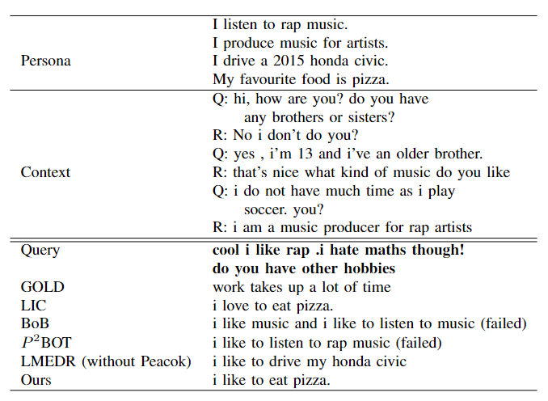

# Machine Learning @EPFL 2023
### Code for Commonsense Persona-Grounded Dialogue Challenge ([CPDC 2023](https://www.aicrowd.com/challenges/commonsense-persona-grounded-dialogue-challenge-2023/problems/task-1-commonsense-dialogue-response-generation/submissions)). 
Adjusted from [LMEDR](https://github.com/Chenrj233/LMEDR.git) official implementation
### Team @[Zewei Zhang](https://github.com/Takui9), @[Yihan Wang](https://github.com/Ivonne320)


## Requirements

Check the package requirements

- python==3.8
- torch==1.9.1
- transformers==4.14.1
- pytorch-ignite==0.4.9

Please install ParlAI, which can be done in the following ways
```bash
git clone https://github.com/Chenrj233/ParlAI.git
cd ParlAI
python setup.py install # you can try <pip install -e . --no-cache-dir> instead in case of failure
```

Please replace `eval_f1.py` and `eval_hits.py` in `/ParlAI/projects/convai2/` with the corresponding files in `/other/`. Similarly, replace the `generation_utils.py` in `transformers/` with the corresponding files in `/other/`, the file is in a path similar to
```
| -- python3.8
	| -- site-packages
		| -- transformers
			| -- modeling_utils.py
			| -- generation_utils.py
			| -- ...
```

## Data

The datasets processed and used in this project can be obtained from the following link:

|  Dataset| Used in  |
|  ----   |  ----  |
|  [PersonaChat-PEACOK ](https://drive.google.com/drive/folders/1GMr4l_ORRvW2mFF6rAShjrFIG1PLfH5R?usp=sharing) | Training the DDM  |
| [DNLI](https://wellecks.com/dialogue_nli/) | Training the ERM  |

[PersonaChat-PEACOK ](https://drive.google.com/drive/folders/1GMr4l_ORRvW2mFF6rAShjrFIG1PLfH5R?usp=sharing) contains all four datasets used in our report. The details of the models and used datasets are given as follows:

| Model | Dataset Used | Epoch Number
|  ----   |  ----  | ---- |
| Our best model | `Original_best` | 10 |
| Case 1 (Table V) | `Induced_retrieved_2_1` | 1 |
| Case 2 (Table V) | `Induced_retrieved_kmax5` | 1 |
| Case 3 (Table V) | `Induced_retrieved_10_2` | 1 |

Please directly download the files in folder `Dataset/LMEDR` for the LMEDR model training. 

## Training


Put the downloaded datasets in corresponding subdirs in `data/`, change the datapaths in line `#135` & `#138` in ```train_PersonaChat.py``` and ```train_PersonaChat_partner.py```, use the following script to train without partner persona constraints. If you want to train on the revised dataset, please add `--revised`. We also provide a launch file ```other/chat_train.bat``` that can be used on EPFL HPC resource Scitas.
	
```
python train_PersonaChat.py --lr 8e-6 \
--epochs 20 \
--train_batch_size 2 \
--valid_batch_size 2 \
--infer_batch_size 64 
```

Use the following script to train with partner persona constraints:
```
python train_PersonaChat_partner.py --lr 8e-6 \
--epochs 20 \
--train_batch_size 2 \
--valid_batch_size 2 \
--infer_batch_size 64 
``` 
## Evaluation
Our current best-performing model checkpoints can be obtained from [here](https://drive.google.com/drive/folders/1GMr4l_ORRvW2mFF6rAShjrFIG1PLfH5R?usp=sharing), place it under ```persona_original```.

- Hits@1
```
python evaluation_PersonaChat.py --model_checkpoint persona_original/Model/Original_best_model \
--eval_type hits@1
```
- F1
```
python evaluation_PersonaChat.py --model_checkpoint persona_original/Model/Original_best_model \
--eval_type f1 \
--beam 2 \
--max_history 7
```
- PPL
```
python train_PersonaChat.py --load_from persona_original/Model/Original_best_model \
--eval
```
- C.Score

	Please refer to [PAML](https://github.com/HLTCHKUST/PAML).

## Generate dialogue prediction

Please adjust the checkpoint path in ```Infer_Generation/agents/LMEDR_agents.py``` and run the following code to generate dialogue. We provide dummy input context in ```Infer_Generation/dummy_data.json```, you can follow the structure and create your own input data.

```
cd Infer_Generation
python local_evaluation.py
```
Check out our current best model's response: 

